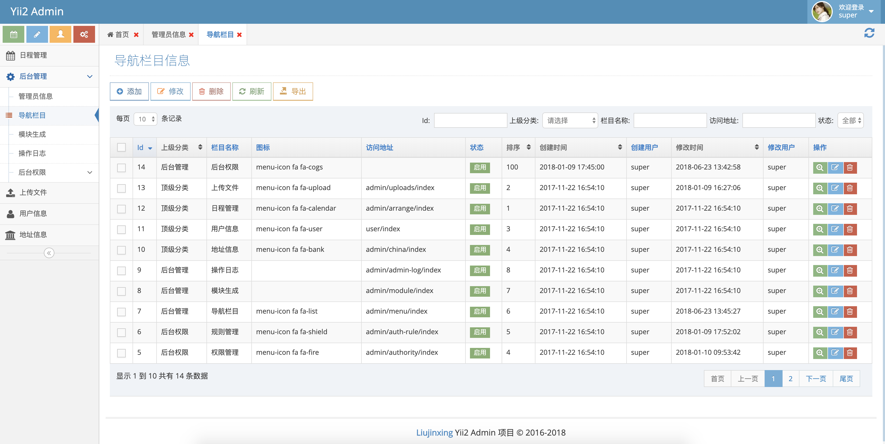

Yii2 Ace Admin 后台扩展模块
==========================

 
[](https://packagist.org/packages/jinxing/yii2-admin)
[](https://packagist.org/packages/jinxing/yii2-admin)
[](https://packagist.org/packages/jinxing/yii2-admin)
[](https://github.com/myloveGy/yii2-admin/issues)
[](https://github.com/myloveGy/yii2-admin/network)
[](https://github.com/myloveGy/yii2-admin/stargazers)
[](https://github.com/myloveGy/yii2-admin/blob/master/LICENSE.md)

[change to English](/README.en-US.md)

## 作者博客

[https://mylovegy.github.io/blog/](https://mylovegy.github.io/blog/)

## 简介

使用的 [ace admin](http://ace.jeka.by/) 前端框架, 为`yii2`开发的一个后台模块; 
对于二次开发比较方便，包含了基本的后台功能

## 功能特性

* 包含基本的后台功能
    - 管理员管理: 登录、登出、修改密码等
    - 菜单管理: 可视化动态菜单、根据权限显示菜单
    - 权限管理: 角色、权限、用户的管理  
    
* 使用`yii2`自带的`RBAC`权限管理
* 对于二次开发比较方便
    - 定义基本控制器(封装了基本的`CURD`操作), 后续开发基于基础控制器继承修改
    - 拥有模块生成功能(类似于`gii`), 可视化生成代码模板, 简单操作即可生成 控制器`controller`、模型`model`, 视图`views`
        文件，提高开发效率

## 安装

### 安装要求

* PHP >= 5.4
* MySQL

### 全新项目安装

全新项目安装可以直接使用[liujx/yii2-app-advanced](https://packagist.org/packages/liujx/yii2-app-advanced)

### 在已有项目中安装

使用 `composer` 下载包文件 

```
composer require jinxing/yii2-admin
```

### 配置模块信息

在你的 `main.php` 配置文件中添加下面配置

```php
return [
    'modules' => [
        'admin' => [
            'class' => 'jinxing\admin\Module',
        ]
    ],
    'components' => [
        
        // 后台登录用户组件信息
        'admin' => [
            'class'           => 'yii\web\User',
            'identityClass'   => 'jinxing\admin\models\Admin',
            'enableAutoLogin' => true,
            'loginUrl'        => ['/admin/admin/default/login'],
            'idParam'         => '_adminId',
            'identityCookie'  => ['name' => '_admin', 'httpOnly' => true],
        ],
        
        // 后台使用的语言配置信息
        'i18n' => [
            'translations' => [
                'admin' => [
                    'class'          => 'yii\i18n\PhpMessageSource',
                    'sourceLanguage' => 'en',
                    'basePath'       => '@jinxing/admin/messages'
                ],
            ],
        ],
        
        // 配置权限使用数据库
        'authManager'  => [
            'class' => 'yii\rbac\DbManager',
        ],
                
    ]
];
```

在你的 `params.php` 配置文件添加如下配置信息

```php
return [
    // 这个配置是为了导入权限信息需要配置的，就是配置后台模块的路径 
    'admin_rule_prefix' => 'admin',                        

    // 登录成功首页是否需要显示其他信息
    'projectOpenOther' => true,
    
    // 项目信息
    'projectName'      => 'Yii2 后台管理系统',              
    'projectTitle'     => 'Yii2 后台管理系统',
    'companyName'      => '<span class="blue bolder"> Liujinxing </span> Yii2 Admin 项目 &copy; 2016-2018',  
];
```

### 使用数据库迁移、导入后台所需的数据库信息、需要顺序执行下面命令

#### 需要配置 `console`

在 `console` 配置中的 `components` 组件中加入权限配置信息

```php
return [
    'components' => [
        // 权限配置
        'authManager'  => [
            'class' => 'yii\rbac\DbManager',
        ],
    ],
];
``` 

- 高级版本的配置文件在 `console/config/main.php`中
- 基础版本的配置文件在 `config/console.php`中

#### 导入权限表信息
```
php yii migrate --migrationPath=@yii/rbac/migrations
```

#### 导入后台表信息和默认权限、菜单信息
```
php yii migrate --migrationPath=@jinxing/admin/migrations
```

### 你可以愉快的使用了

访问地址

```
// 登录地址、域名需要根据你的域名修改
http://localhost/path/to?index.php?r=admin/default/login
```

#### 默认的账号和密码

1. 超级管理员
    - username: super  
    - password: admin123

2. 普通管理员
    - username: admin
    - password: admin888

## 使用文档

### [模块配置说明](./docs/module.md)
### [控制器配置说明](./docs/controller.md)
### [前端`MeTables`配置说明](https://github.com/myloveGy/jinxing-tables)

## 后台预览

1. 登录页面

2. 数据显示


3. 权限分配

4. 模块生成(代码生成)
