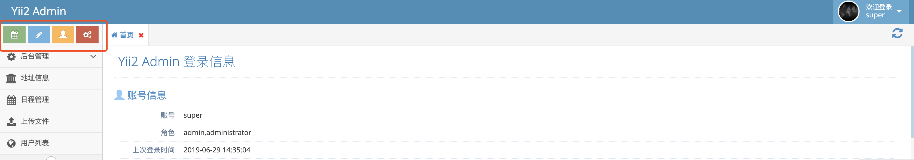
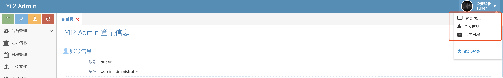

模块配置说明
==========

## 模块 `jinxing\admin\Module`类的可配置项

[可以直接参考类文件](https://github.com/myloveGy/yii2-admin/blob/master/src/Module.php)

`Yii2`的配置都是通过数组 `class`字段指定使用类，其他`key`指定类属性的方式去配置的；
所以可以直接参考类有哪些属性，就可以在配置文件中指定

例如: 
```php
$config = [
    'modules'             => [
        'admin' => [
             // 指定模块使用 后台模块类
            'class' => 'jinxing\admin\Module',
            
            // 指定模块类 $user 属性值， 确定模块使用的 登录用户组件名称
            'user'  => 'user',
        ],
    ],
];
```

### 可配置属性列表

该列表只是列出的 `jinxing\admin\Module` 自定义的属性，其父类的属性 `yii\base\Module` [参考](https://www.yiichina.com/doc/api/2.0/yii-base-module)

| 名称 | 类型 | 默认值 | 说明 |
|:--------|:-----|:----|:------|
|`$user`|`string`|`admin`|使用的登录用户组件名称|
|`$allowControllers`|`array`|`['default']`|不需要验证权限的控制器|
|`$verifyAuthority`|`boolean`|`true`|是否需要验证权限|
|`$defaultAction`|`string`|`default/system`|登录成功欢迎页面的路由|
|`$frameNumberSize`|`int`|8|后台界面允许开启`iframe`的个数,超过会隐藏|
|`$frameNumbershowClose`|`int`|3|后台界面开启多少个`iframe`显示关闭全部按钮|
|`$leftTopButtons`|`array`| `[...]`|后台界面左侧按钮配置 |
|`$userLinks`|`array`|`[...]`|后台界面登录用户右侧按钮配置|


## `Yii2`高级版后台配置模板

main.php 部分代码，请不要直接复制粘贴

```php
return [
    // ... 你的其他配置项
    
    // 后台模块配置
    'modules'             => [
        'admin' => [
            'class' => 'jinxing\admin\Module',
            'user'  => 'user',
        ],
    ],
    'components'          => [
    
        // ... 你的其他配置
        
        
        'user'         => [
            'identityClass'   => 'jinxing\admin\models\Admin',
            'loginUrl'        => '/admin/default/login',
            'enableAutoLogin' => true,
            'identityCookie'  => ['name' => '_identity-backend', 'httpOnly' => true],
        ],
        
        // 后台模块相关的配置 start ---------------------->
        // 错误处理，这个视自己情况配置
        'errorHandler' => [
            'errorAction' => 'admin/default/error',
        ],
        
        // 权限配置使用 db
        'authManager'  => [
            'class' => 'yii\rbac\DbManager',
        ],
        
        // 路由美化配置，建议单非必要配置
        'urlManager' => [
            'enablePrettyUrl' => true,
            'showScriptName'  => false,
            'rules'           => [
            ],
        ],
        
        // 资源管理，一定要配置， Yii2 默认使用的jquery 版本 和 使用的 ace admin jquery 有冲突
        'assetManager' => [
            'bundles' => [
                // 去掉自己的bootstrap 资源
                'yii\bootstrap\BootstrapAsset' => [
                    'css' => [],
                ],
                // 去掉自己加载的Jquery
                'yii\web\JqueryAsset'          => [
                    'sourcePath' => null,
                    'js'         => [],
                ],
            ],
        ],
        
        // 使用语言配置信息
        'i18n' => [
            'translations' => [
                'admin' => [
                    'class'          => 'yii\i18n\PhpMessageSource',
                    'sourceLanguage' => 'en',
                    'basePath'       => '@jinxing/admin/messages',
                ],
            ],
        ],
        
        // 后台模块相关的配置 end ---------------------->
    ],
    
];
```

### 参考项目

- [Yii2 Ace Admin](https://github.com/myloveGy/yii2-ace-admin)
- [Yii2 Ace Admin 项目预览](https://yii2.sh-jinger.com)

- 账号: admin 密码： admin888

## `Yii2`基础版后台配置模板 

web.php 部分代码，请不要直接复制粘贴

```php

$config = [

    // ... 你的其他配置


    // 后台模块配置，注意这里是两层模块
    'modules'    => [
        'admin' => [
            'class'   => 'app\modules\admin\Admin',
            'user'    => 'admin',
            'modules' => [
                'admin' => [
                    'class'          => 'jinxing\admin\Module',
                    'user'           => 'admin',
                    'leftTopButtons' => [],
                    'userLinks'      => [],
                ],
            ],
        ],
    ],
    'components' => [
        // ... 你的其他配置
        
        // 前端用户组件
        'user' => [
            'identityClass'   => 'app\models\User',
            'enableAutoLogin' => true,
            'idParam'         => '_userId',
            'loginUrl'        => ['/'],
            'identityCookie'  => ['name' => '_user', 'httpOnly' => true],
        ],
        
        // 后台模块相关的配置 start ---------------------->
        // 后端用户组件
        'admin' => [
            'class'           => 'yii\web\User',
            'identityClass'   => 'jinxing\admin\models\Admin',
            'enableAutoLogin' => true,
            'loginUrl'        => ['/admin/admin/default/login'],
            'idParam'         => '_adminId',
            'identityCookie'  => ['name' => '_admin', 'httpOnly' => true],
        ],
        
        // 错误处理，这个视自己情况配置
        'errorHandler' => [
            'errorAction' => 'admin/default/error',
        ],
        
        // 权限配置使用 db
        'authManager'  => [
            'class' => 'yii\rbac\DbManager',
        ],
        
        // 路由美化配置，建议但非必要配置
        'urlManager' => [
            'enablePrettyUrl' => true,
            'showScriptName'  => false,
            'rules'           => [
                   // ... 可以配置你的定制路由
            ],
        ],
                
        // 使用语言配置信息
        'i18n' => [
            'translations' => [
                'admin' => [
                    'class'          => 'yii\i18n\PhpMessageSource',
                    'sourceLanguage' => 'en',
                    'basePath'       => '@jinxing/admin/messages',
                ],
            ],
        ],
        
        // 后台模块相关的配置 end ---------------------->
    ],
];
```

### 关于两层模块配置

因为是基础版本，没有前后台分开，需要需要一个配置一个后台模块，这个是第一层模块配置

然后你这个模块需要使用 `jinxing/yii2-admin` 这个模块的功能，所以需要在你的后台模块中配置`jinxing/yii2-admin`

这个是第二层模块

>比较简单的配置自己后台模块的方法，你的后台模块类继承`jinxing\admin\Module`，你的后台模块就可以像`jinxing\admin\Module`
那样配置,模块的里面的控制器直接继承 `jinxing\admin\controllers\Controller`

上面的只是建议，如果不用继承的方式，自己生成模块，控制器，处理方式可参考 高级版本

### 注意事项

因为是两层模块，所以在初始化数据迁移之前，一定要在`params.php`文件中配置好`admin_rule_prefix`
这个参数;如果按照上面的配置

配置规则：`你的模块/后台模块名称`

params.php 文件

```php
return [
    // 配置后台模块导入菜单、权限 的路由前缀
    'admin_rule_prefix' => 'admin/admin',
];
```

将配置配置好， 再使用数据库迁移功能

### 参考项目

- [考试系统](https://github.com/myloveGy/examination)
- [考试系统预览](https://examination.sh-jinger.com/admin)

- 账号: admin 密码：admin123

## 其他配置说明

### `$user` 的说明

`$user`指定模块使用的登录用户的组件；在项目中，可能会存在多个登录用户组件；
例如基础版本，前台用户组件和后台用户组件

```php
$config = [
    'components' => [
        // 前台登录用户
        'user' => [
            'identityClass'   => 'app\models\User',
            'enableAutoLogin' => true,
            'idParam'         => '_userId',
            'loginUrl'        => ['/'],
            'identityCookie'  => ['name' => '_user', 'httpOnly' => true],
        ],
        
        // 后台登录用户
        'admin' => [
            'class'           => 'yii\web\User',
            'identityClass'   => 'jinxing\admin\models\Admin',
            'enableAutoLogin' => true,
            'loginUrl'        => ['/admin/admin/default/login'],
            'idParam'         => '_adminId',
            'identityCookie'  => ['name' => '_admin', 'httpOnly' => true],
        ],
    ]
];
```

>因为默认`$user = 'admin';`所以在`Yii2`高级版本，虽然是前后台项目分开，后台只有
一个用户组件，但`Yii2`默认的用户组件名称为`user`,所以配置的时候，需要配置`'user' => 'user'`

```php
$config = [
    // ... 你的其他配置
    'modules'             => [
        'admin' => [
            'class' => 'jinxing\admin\Module',
            'user'  => 'user',
        ],
    ],
    'components'          => [
        'user'         => [
            'identityClass'   => 'jinxing\admin\models\Admin',
            'loginUrl'        => '/admin/default/login',
            'enableAutoLogin' => true,
            'identityCookie'  => ['name' => '_identity-backend', 'httpOnly' => true],
        ],
        
        // ... 你的其他配置
    ]
];
```


### `$leftTopButtons` 的说明



不需要的话，配置为空数组

```php
$config = [
    'modules' => [
        'admin' => [
            'class'          => 'jinxing\admin\Module',
            'leftTopButtons' => [],
        ],
    ],
];
```

### `$userLinks` 的说明



不需要的话，配置为空数组

```php
$config = [
    'modules' => [
        'admin' => [
            'class'     => 'jinxing\admin\Module',
            'userLinks' => [],
        ],
    ],
];
```

 [ 关于 controller 配置 →](./controller.md)